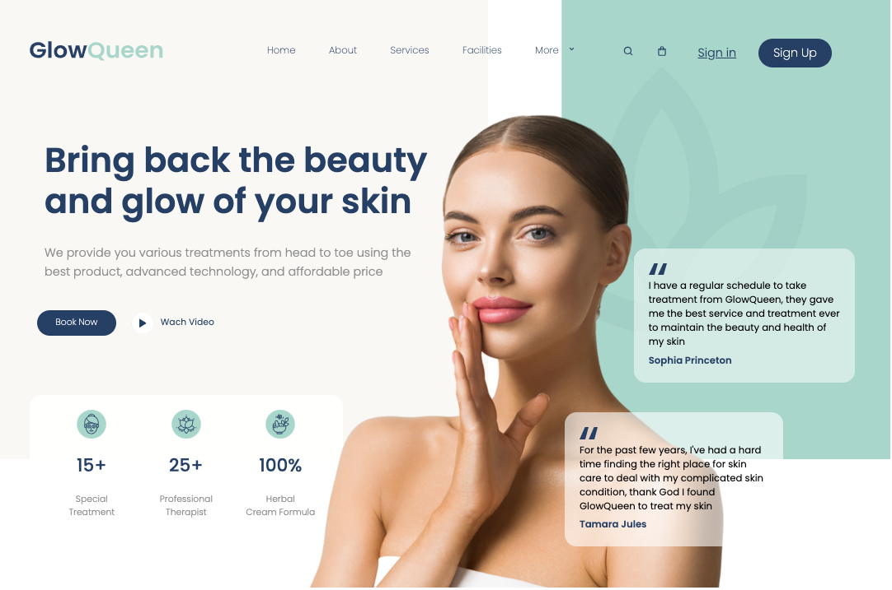

# Header Spa

Proyecto hecho con **Vite + Sass** que reproduce el diseño de un header moderno de spa.

 <!-- podés capturar y guardar una imagen de tu proyecto como screenshot.png -->

## 🛠 Tecnologías usadas

- Vite
- Sass
- HTML5
- CSS3

## 🚀 Cómo usarlo

1. Cloná el repositorio
2. Instalá las dependencias con `npm install`
3. Iniciá el servidor con `npm run dev`

## ✨ Autor

[Martín Carpovich](https://www.linkedin.com/in/martin-carpovich/)

